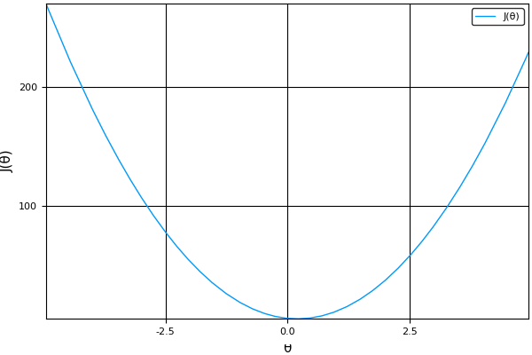

Part I
===============================================================================

Math basic

Linear Model
----------------------------------------------------------------------

* 經典的 XOR 問題，無法用 linear model 解。需要做高維度的 feature extraction
  或是 NN 的轉換 座標空間 來解。

Linear Regression
----------------------------------------------------------------------

* 常用 MSE 作為 cost function

.. math::

    J(\vec{\theta}) = \frac{1}{2m} \sum_i^m (h_{\vec{\theta}}(\vec{x}) - y)^2

* 這個 cost function 有 close form solution, 可使用 Normal Equation Method
  求解，但是在高維度會用 GD， why ?

    * http://stats.stackexchange.com/questions/23128

Univariable Linear Regression
++++++++++++++++++++++++++++++++++++++++++++++++++++++++++++

* Univariable -> 單變數

Assume:

.. math::

    h_{\theta_0, \theta_1}(x) = \theta_0 + \theta_1 x

The cost function will be:

.. math::

    J(\theta_0, \theta_1) =
    \frac{1}{2m} \sum_i^m (h_{\theta_0, \theta_1}(x_i) - y_i)^2

Then, if we simplify :math:`h`, let :math:`\theta_0 = 0`,

.. math::

    \begin{align}
        J(\theta_1) & = \frac{1}{2m} \sum_i^m (h_{\theta_1}(x_i) - y_i)^2 \\
                    & = \frac{1}{2m} \sum_i^m (\theta_1 x_i - y_i)^2
    \end{align}

Objective function:

.. math::

    arg\min_{\theta_1} J(\theta_1)

It looks like this:

This objective function is *convex* and has a close form solution.

Gradian Descent
----------------------------------------------------------------------

* learning rate :math:`\eta` 對 linear regression 的影響：

  * 在接近 minimum 而且 :math:`\eta` 過大時，下一次 iteration 會穿過 minimum
    然後 cost function 的微分量可能會更大，若更大會造成後續 iteration 發散。

* Batch Gradian Descent, 對所有的 training set 都考慮後的計算。

* http://mccormickml.com/2014/03/04/gradient-descent-derivation/

ReLU
----------------------------------------------------------------------

.. code-block:: julia

    relu(x) = (x > 0) ? x : 0

https://en.wikipedia.org/wiki/Rectifier_(neural_networks)

- low computational cost. 但我認為這不是決定性的因素

- 對於 deep 的 MLP 在做 back propagation 的時候， sigmoid function or ``tanh``
  容易造成在經過多次微分後，在前面的的 layer 的變動量很小，收斂效果差。
  sigmoid 跟 ``tanh`` 的 upper / lower bound 在 deep MLP 底下反而是收斂的阻礙。

- ReLU 在 x 輸出是 0 的部分，造成了某種 topology 的選擇，
  如果採用 fully connected NN ， outcome 為 0 的部分可以想象成把 connection
  拔掉。
